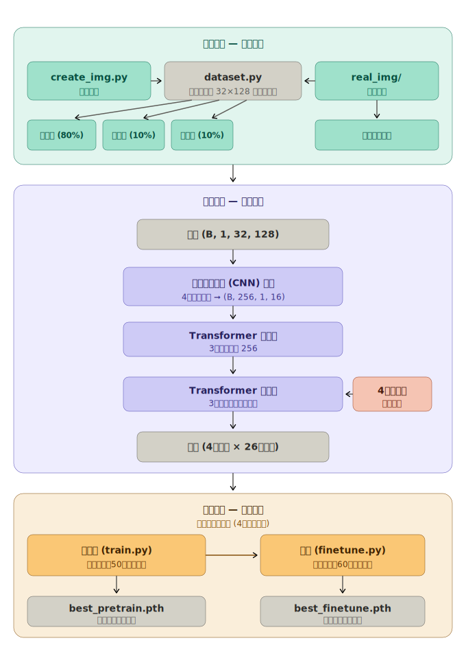

# Tixcraft 驗證碼辨識模型

English version: [README.md](../README.md)

## 專案簡介

基於 PyTorch 的 Tixcraft 驗證碼辨識模型，目標是辨識 4 個小寫英文字母組成的驗證碼。

流程涵蓋合成驗證碼圖片生成、資料集讀取、使用合成資料預訓練，以及使用真實圖片進行微調。辨識任務被設計為固定長度序列預測，不做字元切割。



## 專案結構

```text
.
├── assets/
│   ├── pipeline_en.svg
│   └── pipeline_zh.svg
├── create_img.py
├── dataset.py
├── model.py
├── train.py
├── finetune.py
├── SpicyRice-Regular.ttf
├── README.md
└── README_zh.md
```

預期的資料目錄結構：

```text
synthetic/
├── train/
│   ├── labels.txt
│   └── *.png
├── val/
│   ├── labels.txt
│   └── *.png
└── test/
    ├── labels.txt
    └── *.png

real_img/
└── *.png
```

## 執行環境

- Python 3.14.0 以上
- CUDA 13.0 以上

## 快速開始

### 1. 建立虛擬環境

**Windows**
```bash
python -m venv venv
venv\Scripts\activate
```

**Linux**
```bash
python -m venv venv
source venv/bin/activate
```

### 2. 安裝套件

```bash
pip install -r requirements.txt
```

`requirements.txt` 內容：

```text
numpy
pillow
```

### 3. 安裝 PyTorch

**Windows (CUDA 13.0+)**
```bash
pip install torch torchvision --index-url https://download.pytorch.org/whl/cu130
```

**Linux**
```bash
pip install torch torchvision
```

請確認安裝的版本與本機 CUDA 環境相符。

### 4. 執行

建議執行順序：

1. `python create_img.py` — 生成合成驗證碼資料
2. `python train.py` — 使用合成資料預訓練
3. `python finetune.py` — 使用真實圖片微調

其他可選步驟：

- `python dataset.py` — 確認資料集讀取是否正常
- `python model.py` — 確認模型架構是否正常

## 模型架構

模型定義在 `model.py`，名稱為 `CaptchaTransformer`，運作流程如下：

1. 輸入圖片轉為灰階並縮放至 `32 x 128`
2. CNN backbone 提取視覺特徵
3. Feature map 展平為序列
4. 加入 positional encoding
5. Transformer encoder 建模全局上下文
6. 四個 learnable queries 送入 Transformer decoder
7. 每個 query 各自預測一個字元位置
8. 輸出 shape：`(B, 4, 26)`

模型直接並行預測全部 4 個位置，每個位置對應 26 個類別（小寫 a–z）。

## 資料集格式

### 合成資料

由 `create_img.py` 生成，每個 split 包含圖片檔與 `labels.txt`：

```text
abcd.png    abcd
wxyz.png    wxyz
```

### 真實資料

標籤從檔名解析，以下格式均對應標籤 `abcd`：

```text
abcd.png
abcd_v2.png
abcd_001.png
```

只接受恰好 4 個小寫字母的標籤。

## 前處理與資料增強

由 `dataset.py` 處理。所有圖片會經過：

- 轉為灰階
- 縮放至 `32 x 128`
- 正規化（mean `0.5`，std `0.5`）

訓練時額外套用：

- random affine transform
- 亮度與對比度 jitter
- Gaussian blur
- 銳利度調整

## 訓練流程

### 步驟一：生成合成資料

```bash
python create_img.py
```

預設生成 50,000 張，分成 `synthetic/train`、`synthetic/val`、`synthetic/test`。

### 步驟二：預訓練

```bash
python train.py
```

預設設定：

- batch size：256
- epochs：50
- learning rate：`3e-4`
- optimizer：AdamW
- scheduler：OneCycleLR

最佳 checkpoint 儲存為 `best_pretrain.pth`。

### 步驟三：微調

將真實驗證碼圖片放入 `real_img/`，執行：

```bash
python finetune.py
```

預設設定：

- batch size：64
- epochs：60
- learning rate：`5e-5`
- optimizer：AdamW
- scheduler：CosineAnnealingLR
- early stopping patience：15

載入 `best_pretrain.pth`，最佳結果儲存為 `best_finetune.pth`。

## 損失函數與評估指標

對 4 個位置各自計算 cross-entropy loss，總 loss 為四者相加。

訓練過程追蹤兩個指標：

- **全序列準確率**：4 個字元全部正確才算對
- **字元準確率**：計算所有位置中個別字元的正確率

## 模型權重

模型與 real_img 透過 GitHub Releases 發佈。

- [最新模型權重（Latest Release）](https://github.com/j1nxggg/tixcraft_model/releases/latest)
- [Oficial Captcha Picture（real_img 資料集）](https://github.com/j1nxggg/tixcraft_model/releases/tag/Real_Img)

## 限制

- 固定驗證碼長度為 4
- 僅支援小寫英文字母
- 固定輸入尺寸 `32 x 128`

目前不包含：

- 推論腳本
- ONNX / TensorRT 匯出
- 超參數直接寫在程式碼內，無獨立設定檔
